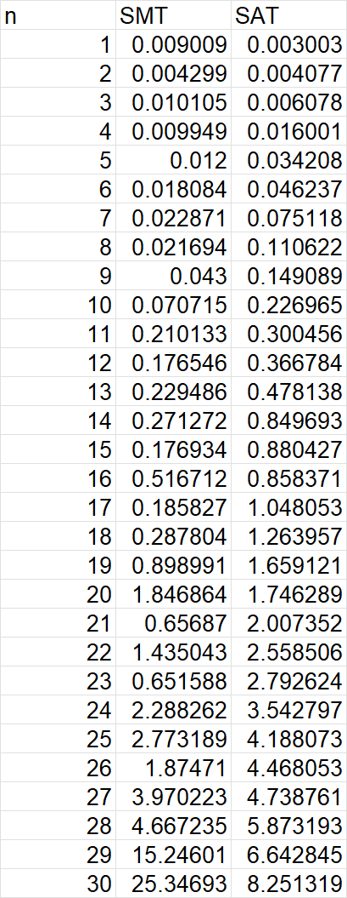
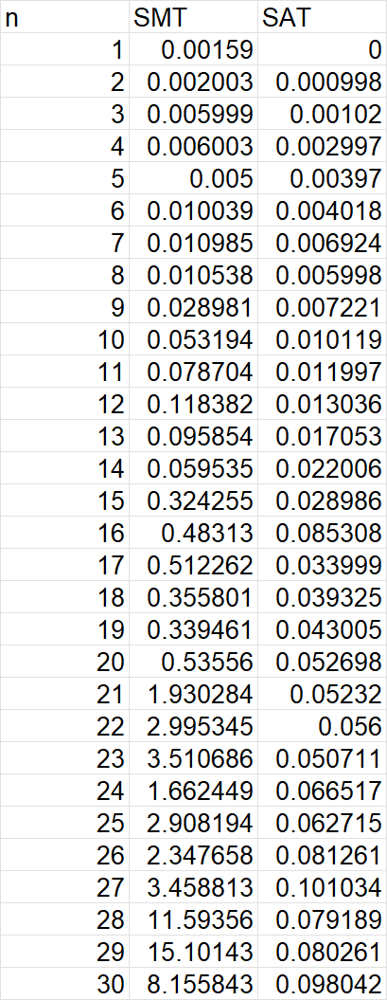
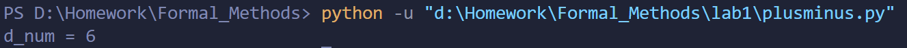
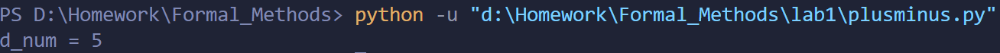

# 实验作业1

## 实验任务
使用pure SAT 求解N-Queen 问题, 并对比 PPT 中 SMT 的实现的效率

## 代码
### SMT
参考PPT中的代码，增加时间监测
```python
def SMT(n):
    Q = [Int('Q_ % i' % (i + 1)) for i in range(n)]
    val_c = [And(1 <= Q[i], Q[i] <= n) for i in range(n)]
    col_c = [Distinct(Q)]
    diag_c = [If(i == j, True,
                And(i + Q[i] != j + Q[j], i + Q[j] != j + Q[i]))
              for i in range(n) for j in range(i)]
    solver = Solver()
    solver.add(val_c + col_c + diag_c)

    start = time.time()
    if solver.check() == sat:
        model = solver.model()
        print(model)
    else:
        print(None)
    finish = time.time()
    return finish - start
```
### SAT
定义一个n*n的棋盘，用bool变量表示皇后的有无。参照PPT上给出的约束表达式分别增加行列和对角线的约束规则
```python
def SAT(n):
    board = [[Bool("x_%s_%s" % (i, j)) for j in range(n)] for i in range(n)]
    # row constraints & column constraints
    constr = [Or([board[i][j] for j in range(n)]) for i in range(n)]
    constr += [Or(Not(board[i][j]), Not(board[i][k])) for i in range(n) for j in range(n) for k in range(j + 1, n)]
    constr += [Or([board[i][j] for i in range(n)]) for j in range(n)]
    constr += [Or(Not(board[i][j]), Not(board[k][j])) for j in range(n) for i in range(n) for k in range(i + 1, n)]
    # diagonal constraints
    for i in range(n):
        for ii in range(i + 1, n):
            for j in range(ii - i, n):
                jj = j - ii + i
                constr += [Or(Not(board[i][j]), Not(board[ii][jj]))]
            for j in range(n - ii + i):
                jj = j + ii - i
                constr += [Or(Not(board[i][j]), Not(board[ii][jj]))]

    solver = Solver()
    solver.add(constr)

    start = time.time()
    for k in range(1):
        if solver.check() == sat:
            model = solver.model()
            solution = []
            for i in range(n):
                for j in range(n):
                    if model[board[i][j]]:
                        solution += [j]
            print(solution)

            # 寻找其他解
            solver.add(Or([Not(board[i][solution[i]]) for i in range(n)]))
        else:
            print(None)
    finish = time.time()
    return finish - start
```
## 用时比较
### 考虑约束用时
n的值范围为1-30，用时结果如下


### 不考虑约束用时
n的值范围为1-30，用时结果如下


## 结论
可见SAT的效率都比SMT要高，且在考虑约束时用时会较大幅度的上升

# 实验作业2
## 实验任务
使用pure SAT 求解d=a-b, 其中,a,b为正整数

## 代码
考虑例子13-7=6，均为超过15故`bits=4`，定义carry为进位。借助异或操作实现二进制数的减法。

```python
def minus():
    bits = 4
    # d = a - b
    a_num = 13
    b_num = 7
    d_num = 0

    a = [Bool("a_%s" % i) for i in range(bits)]
    b = [Bool("b_%s" % i) for i in range(bits)]
    d = [Bool("d_%s" % i) for i in range(bits)]

    carry = [Bool("c_%s" % i) for i in range(bits + 1)]

    constr = [a[i] == (b[i] == (d[i] == carry[i])) for i in range(bits)]
    constr += [carry[i + 1] == (Or(And(b[i], d[i]), And(b[i], carry[i]), And(d[i],carry[i]))) for i in range(bits)]
    constr += [Not(carry[bits])]
    constr += [Not(carry[0])]
    for i in range(bits):
        if b_num & (1 << i):
            constr += [b[i]]
        else:
            constr += [Not(b[i])]
        if a_num & (1 << i):
            constr += [a[i]]
        else:
            constr += [Not(a[i])]

    solver = Solver()
    solver.add(constr)
    if solver.check() == sat:
        m = solver.model()
        for i in range (bits):
            if m[d[i]]:
                d_num += 1 << i
        print("d_num = %s" % d_num)
```
## 结果
对于测试的13-7=6可以正确输出结果

再测试8-3=5，结果正确
