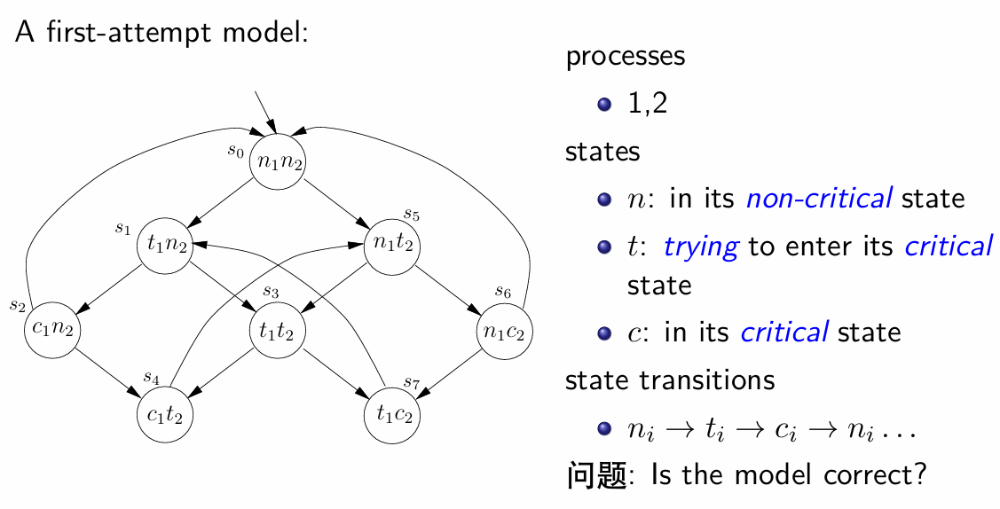

# 形式化方法 实验作业2 firts-attempt model

PB22111599 杨映川

## 1 实验内容

使用NuSMV实现PPT中first-attempt model, 要求用CTL设计Non-blocking, No strict sequencing, 并验证所有四个性质


## 2 代码实现
### 模型实现
根据模型的状态转换，描述模型如下
```s
MODULE main
    VAR
        p1: {n, t, c};
        p2: {n, t, c};

    ASSIGN
        init(p1) := n;
        init(p2) := n;

        next(p1) := case
            p1 = n & p2 = n : {n, t};   -- s0
            p1 = t & p2 = n : {c, t};   -- s1
            p1 = c & p2 = n : {c, n};   -- s2
            p1 = t & p2 = t : {c, t};   -- s3
            p1 = c & p2 = t : {n};      -- s4
            p1 = n & p2 = t : {n, t};   -- s5
            p1 = n & p2 = c : {n, t};   -- s6
            p1 = t & p2 = c : {t};      -- s7
            TRUE : {p1};             -- default case
        esac;

        next(p2) := case
            (next(p1) = p1) & (p2 = n) : t;   -- s0>, s1>, s2>
            (next(p1) = p1) & (p2 = t) & (p1 != c) : c;   -- s3>, s5>
            (next(p1) = p1) & (p2 = c) : n;   -- s6>, s7>
            TRUE : {p2};             -- default case
        esac;
```
### 约束实现
- Safety: Only one process is in its critical section at any time.
- Liveness: Whenever any process requests to enter its critical section, it will eventually be permitted to do so.
- Non-blocking: A process can always request to enter its critical section.
- No strict sequencing: Processes need not enter their critical section in strict sequence.
```s
    -- Safety
    LTLSPEC G !(p1 = c & p2 = c)
    -- Liveness
    LTLSPEC G ((p1 = t -> F p1 = c) & (p2 = t -> F p2 = c))
    -- Non-blocking
    CTLSPEC AG ((p1 = n -> EF (p1 = t)) & (p2 = n -> EF (p2 = t)))
    -- No strict sequencing
    CTLSPEC EG ((p1=c -> EF (p1=c)) & (p2=c -> EF (p2=c)))
```

## 3 检查结果
使用指令`NuSMV first.model`, 输出如下
```s
-- specification AG ((p1 = n -> EF p1 = t) & (p2 = n -> EF p2 = t))  is true  
-- specification EG ((p1 = c -> EF p1 = c) & (p2 = c -> EF p2 = c))  is true  
-- specification  G !(p1 = c & p2 = c)  is true
-- specification  G ((p1 = t ->  F p1 = c) & (p2 = t ->  F p2 = c))  is false 
-- as demonstrated by the following execution sequence
Trace Description: LTL Counterexample
Trace Type: Counterexample
  -> State: 1.1 <-
    p1 = n
    p2 = n
  -> State: 1.2 <-
    p2 = t
  -- Loop starts here
  -> State: 1.3 <-
    p1 = t
  -> State: 1.4 <-
    p1 = c
  -> State: 1.5 <-
    p1 = n
  -> State: 1.6 <-
    p1 = t
```

可见该模型满足`Safety` `Non blocking` `No strict sequencing`三个要求，不满足`Liveliness`