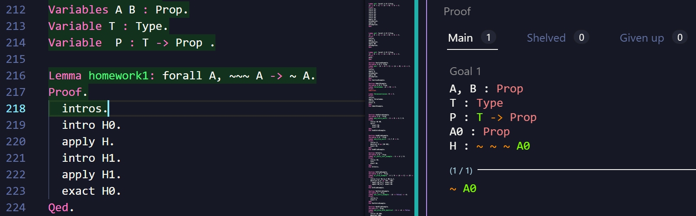
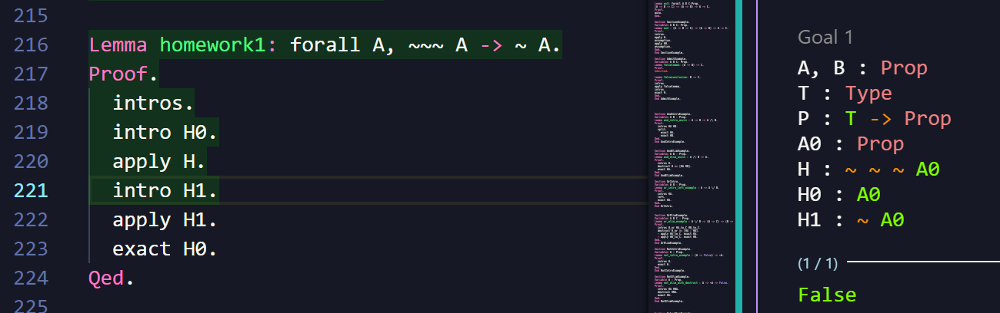
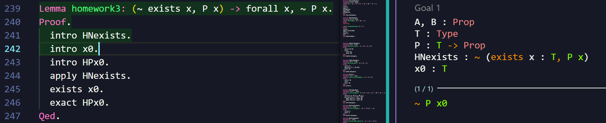
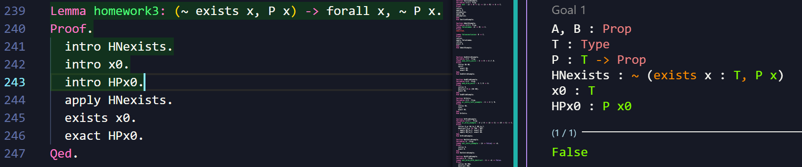
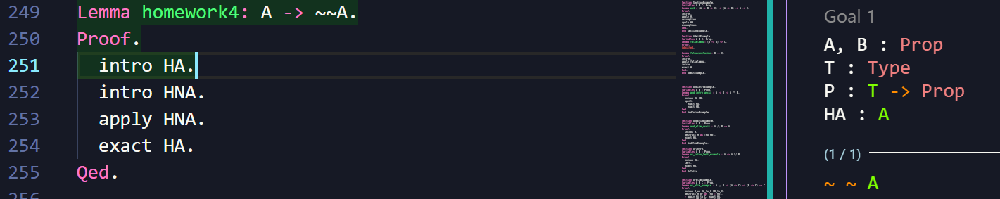
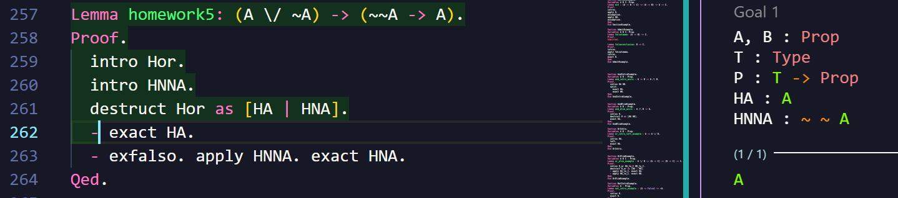

# 形式化方法 实验小作业5 ROCQ
PB22111599 杨映川

## Lemma homework1

```
Lemma homework1: forall A, ~~~ A -> ~ A.
Proof.
  intros.
  intro H0.
  apply H.
  intro H1.
  apply H1.
  exact H0.
Qed.
```








## Lemma homework2

```
Lemma homework2: A \/ B -> ~ (~ A /\ ~ B).
Proof.
  intro Hor.
  intro Hand.
  destruct Hor as [HA | HB].
  destruct Hand as [HNA HNB].
  apply HNA.
  exact HA.
  destruct Hand as [HNA HNB].
  apply HNB.
  exact HB.
Qed.
```


## Lemma homework3

```
Lemma homework3: (~ exists x, P x) -> forall x, ~ P x.
Proof.
  intro HNexists.
  intro x0.
  intro HPx0.
  apply HNexists.
  exists x0.
  exact HPx0.
Qed.
```







## Lemma homework4

```
Lemma homework4: A -> ~~A.
Proof.
  intro HA.
  intro HNA.
  apply HNA.
  exact HA.
Qed.
```





## Lemma homework5

```
Lemma homework5: (A \/ ~A) -> (~~A -> A).
Proof.
  intro Hor.
  intro HNNA.
  destruct Hor as [HA | HNA].
  - exact HA.
  - exfalso. apply HNNA. exact HNA.
Qed.
```





